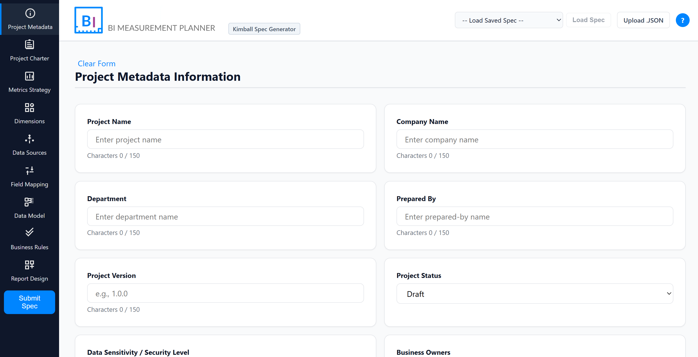
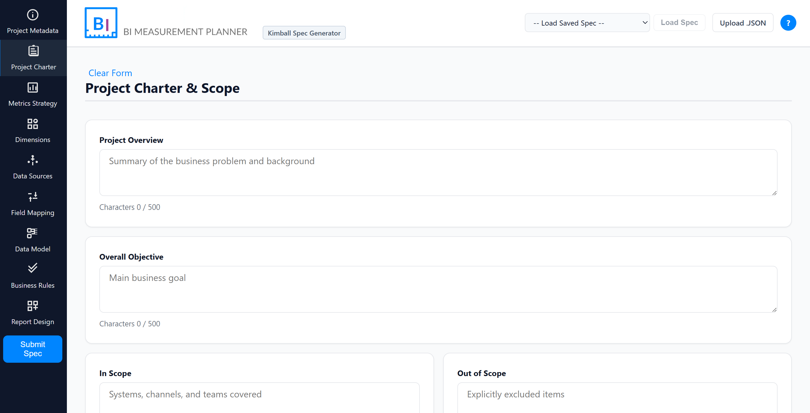
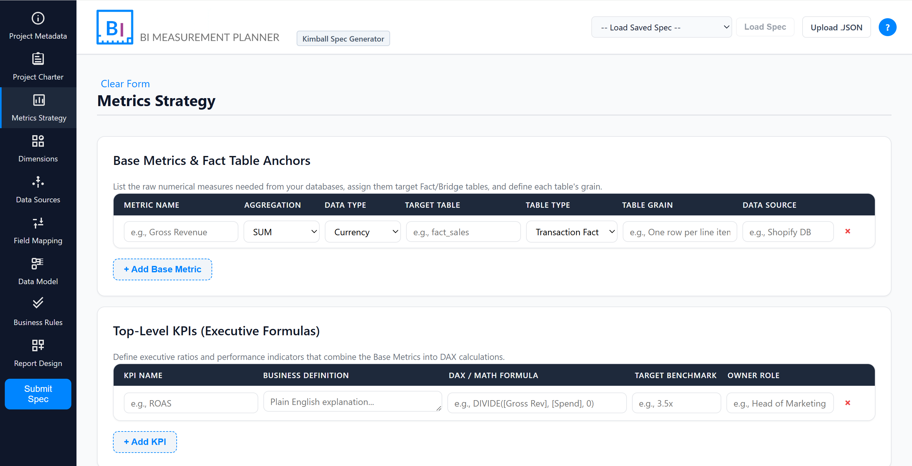
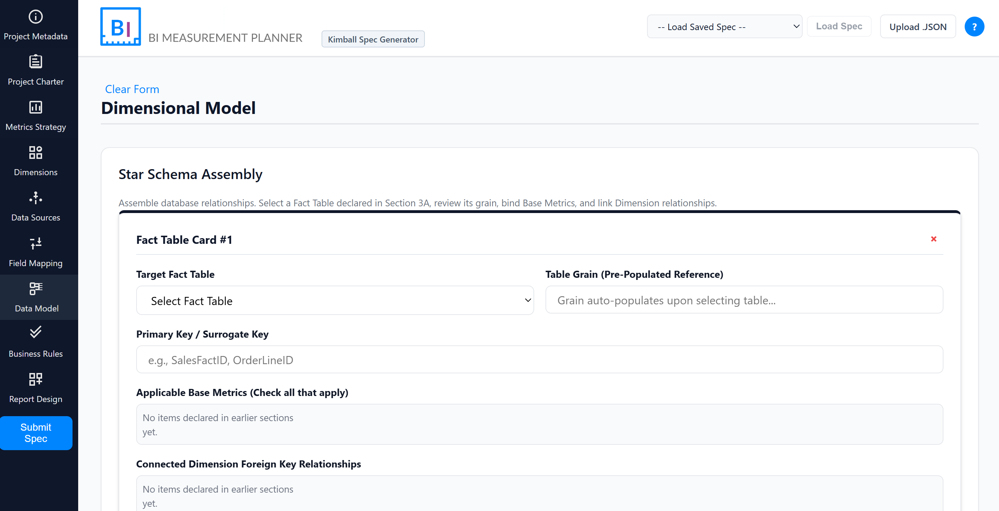
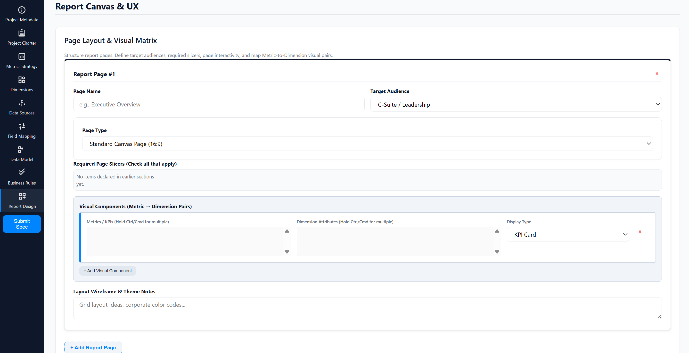
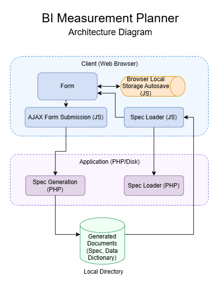

# BI Measurement Planner (Kimball Spec Engine)

> **Architectural Bridge Between Executive Business Strategy and Technical Data Engineering.**

An enterprise workflow web application designed to eliminate "garbage-in, garbage-out" in Business Intelligence projects. Built on **Ralph Kimball’s Dimensional Modeling framework**, the Planner merges executive **user journey mapping** with technical requirements gathering, data grain alignment, field-level ETL mapping, and row-level security (RLS) governance *before* a single line of DAX or M code is written. By enforcing this fundamental planning stage, the application ensures that data analytics models, and subsequently, BI Reports, provide the precise information required to drive measurable business results.

## Executive Impact & Value

| Challenge | Traditional BI Workflow | BI Measurement Planner Solution |
| :--- | :--- | :--- |
| **Requirements Alignment** | Vague requests in Word/Slack leading to constant dashboard rework | Enforces 9-stage structured spec capture across metrics, dimensions, and SLAs |
| **Technical Lineage** | Disconnected data dictionaries out of sync with reports. | Populates information for downstream ETL mappings and Star Schema cards |
| **Developer Handoff** | Manual, error-prone DAX and Star Schema setup | Generates machine-readable `.json` and clean `.md` Data Dictionaries |

## Application Showcase

| Project Metadata | Project Charter |
|----------------|---------------|
|  |  |

| Metrics Strategy | Data Model |
|-----------------------|--------------|
|  |  |

## Report Canvas & UX Design

To ensure a seamless developer handoff, the application includes a dedicated module for BI report wireframing. Users map strategic KPIs directly to report pages, choose visual types, define required slicers, and establish page-level interactivity rules (Tooltips/Drillthroughs).

## Core Capabilities & Technical Architecture

### 1. Cross-Section Data Lineage & Auto-Sync
* **Smart Dropdown Engine:** The sections are designed to make data model design and its documentation a smoother and more intuitive process. Based on the Kimball framework  for demensional modeling, the tool follows a bottom-up approach to guide the user through the design of a data model that supports star, galaxy, and snowflake schemas.

### 2. Multi-Format Spec Code Generation
Upon submission, the application processes inputs through sanitization pipelines to generate production-ready documentation:
* **`measurement_spec.json`:** Machine-readable contract for data pipeline engineers
* **`data_dictionary.md`:** Comprehensive Markdown specification with collapsible Star Schema details, ready for DevOps repos

### 3. Enterprise Security & State Management
* **Anti-XSS & Path Traversal Safeguards:** Strictly sanitizes input parameters and enforces server directory jailing (`realpath()` validation) to prevent directory traversal attacks
* **Resilient Draft Persistence:** Debounced `localStorage` engine saves keystrokes automatically and rebuilds dynamic DOM trees seamlessly upon browser refreshes or accidental window closes

## Architecture Diagram

  

## Generated Spec Artifacts

The outputs generated by this engine provide the foundational documentation for the entire data analytics planning stage.

The tool drives the collaborative communication required between different roles—including Data Analysts and Data Engineers—to ensure that appropriate questions are asked, considered, and that there is alignment among respective fields before development begins.

* [`sample-outputs/ecommerce_analytics_measurement_spec.json`](sample-outputs/ecommerce_analytics_measurement_spec.json) - *Full Machine Contract*
* [`sample-outputs/ecommerce_analytics_data_dictionary.md`](sample-outputs/ecommerce_analytics_data_dictionary.md) - *GitHub-ready Data Dictionary*

## Results & Process Analytics

By implementing this engine as the governance gate, I evaluated the standard BI development lifecycle to identify systemic inefficiencies and delivered targeted solutions to optimize development throughput, data adoption, and reporting quality.

### Strategic Recommendations

#### ✅ Recommendation 1: Shift to the "Data Contract" Handoff
Transition from implicit trust to explicit contracts. Before any Power BI development is authorized, the Data Analyst and Data Engineer must approve a generated specification document, such as `measurement_spec.json`. This drives proactive alignment on data grain, primary keys, and RLS logic, eliminating costly rework caused by misaligned business logic.

#### ✅ Recommendation 2: Adopt "Governance-Left" Data Modeling
Enforce Ralph Kimball's Star Schema rigor at the requirements stage. The planner’s automated grain validation prevents developers from proceeding with broken relationships or inefficient models. This proactively pays down technical debt and ensures the Power BI report is built on a performant, validated semantic model from Day 1.

#### ✅ Recommendation 3: Implement Automated Lineage (Specs-as-Code)
Do not treat documentation as an afterthought. Utilizing the generated `.md` Data Dictionary ensures documentation remains 100% in sync with the semantic model, boosting long-term maintainability and end-user data trust.

## How This Project Powers the Marketing Analytics Project

This repository serves as **Phase 1 (Planning & Governance)** for the **[Marketing Analytics Lifecycle Platform](#)** portfolio project. All metrics, star schemas, and dashboard layouts in the flagship Power BI report originate directly from spec contracts generated by this application.
